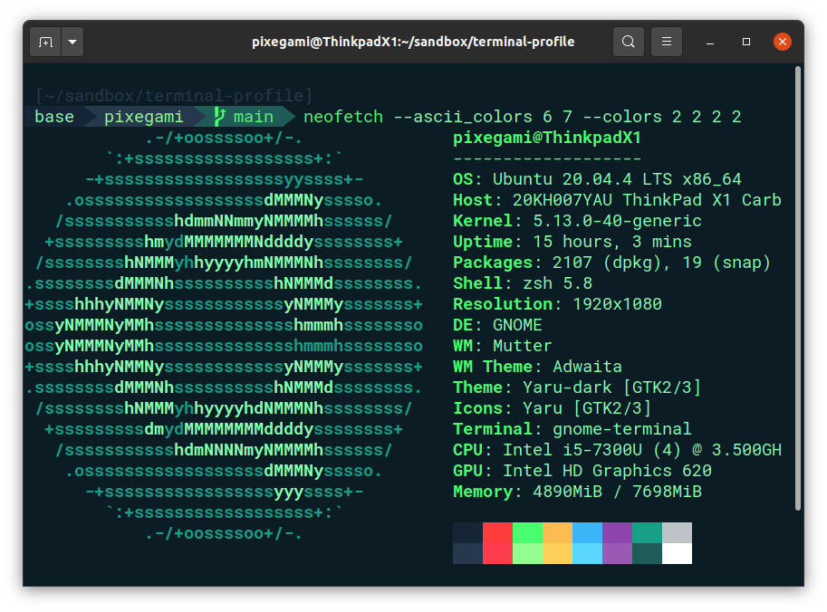

# Pixegami Terminal Profile



This is a copy of [Pisagami Terminal Profile](https://github.com/TimelessTron/terminalProfile).

Why the copy:
- The installation via pip3 leads to an error.
- More plugins have been added
- The installation can be executed via a script.

If you want to thank for the project, please contact the original author [pixagami](https://github.com/pixegami)

The commands was last tested on February 2025 with Ubuntu 22.02 and PopOS 24.02.

# Prerequisites

```bash
# Update your software repositories.
sudo apt-get update
sudo apt-get upgrade

# Install Git.
sudo apt-get install -y git
```

# Installation
## Step by step
### Powerline and fonts
Install pip pipx powerline-status and fonts-powerline.\
Copy fonts to user font folder
```bash
./install_powerline.sh
```

### ZSH, OhMyZSH and Plugins
Install git-core zsh and curl.\
Run [robbyrussell/oh-my-zsh](https://github.com/ohmyzsh/ohmyzsh) installer
```bash
./install_terminal.sh
```
### Profile (plugins, theme, font and color)
Clone plugins to zsh plugin folder
- [zsh-users/zsh-syntax-highlighting](https://github.com/zsh-users/zsh-syntax-highlighting)
- [zsh-users/zsh-autosuggestions](https://github.com/zsh-users/zsh-autosuggestions)
Override ~/.zshrc and copy zsh-theme to the right place.
```bash
./install_profile.sh
```
## Instalation at once
If you want to make zsh first your default terminal later, you can do so with this command
```bash
./full_install.sh
```
If you want to make zsh first your default terminal later, you can do so with this command:
```bash
chsh -s $(which zsh)
```
